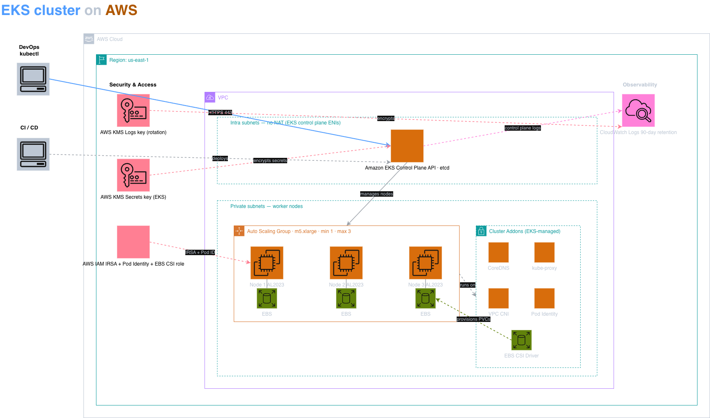

# kite take home assignment

`myapp` is a small Go HTTP service running on Amazon EKS, which can be deployed through Argo CD. It ships with production-grade defaults: values are split
per environment, Prometheus metrics are exposed and visualized through Grafana dashboards and alerts on top. The repo is the **single source of truth** for both the application code
and its deployment configuration. A single `git push` is the only way to
deploy.

---
  ## Table of contents

  - [Architecture overview](#architecture-overview)
    - [VPC Layout](#vpc-layout)
    - [Control plane access](#control-plane-access)
    - [Environments](#environments)
    - [Component scope and chart layout](#component-scope-and-chart-layout)
    - [Prod EKS bootstrap](#prod-eks-bootstrap)
    - [Dev cluster bootstrap](#dev-cluster-bootstrap)
    - [Platform add-ons](#platform-add-ons)
  - [Request flow (prod)](#request-flow-prod)
  - [Directory layout](#directory-layout)
  - [CI/CD](#cicd)
    - [CI](#ci)
    - [CD](#cd)
    - [Adding a new component](#adding-a-new-component)
  - [Observability](#observability)
  - [Security](#security)
  - [Deploying a code change](#deploying-a-code-change)
    - [Local development](#local-development)
    - [Deploying in dev & prod](#deploying-in-dev--prod)
  - [Design decisions & tradeoffs](#design-decisions--tradeoffs)
  - [What I'd improve with more time](#what-id-improve-with-more-time)

## Architecture overview
### VPC Layout
Prod EKS cluster runs in a dedicated VPC in `us-east-1` with CIDR `10.0.0.0/16`, spread across three AZs (`us-east-1a`, `us-east-1b`, and
`us-east-1c`). We have a single VPC dedicated to the production cluster. An **Internet Gateway** is attached to the VPC. Only the public subnets
have a `0.0.0.0/0` route, which points to the internet.

The AWS Load balancer controller places the NLB in the public subnets. The NAT gateway also sits in one of these public subnets (`us-east-1a`) so that it can reach the IGW. We have 3 private subnets one per AZ (`10.0.10.0/24`, `10.0.11.0/24`, `10.0.12.0/24`). The **EKS worker nodes** run here in the private subnet. Their default route is the NAT gateway, which means nodes can pull images, reach Secrets Manager, and so on, but nothing on the internet can reach them directly.

There is a single **NAT gateway**, sitting in one public subnet (`us-east-1a`). All three private subnets' route tables point `0.0.0.0/0` to a NAT Gateway. For production, we would need to have one NAT gateway per AZ.The **EKS control plane** is AWS-managed and runs in AWS's own VPC.



### Control plane access
The EKS API server endpoint is **private only** — the control plane has no public DNS, so a request originating outside the VPC cannot reach the API server at all. Terraform owns this:

  ```hcl
  # ~/TF/prod-cluster/eks.tf 
  cluster_endpoint_private_access = true
  cluster_endpoint_public_access  = false
  ```

```
                                  VPC 10.0.0.0/16  (us-east-1)
    ┌────────────────────────────────────────────────────────────────────────────────────┐
    │                                                                                    │
    │                              Internet Gateway (IGW)                                │
    │                                       ▲                                            │
    │                                       │  0.0.0.0/0  (public subnet route)          │
    │                                       │                                            │
    │   ┌─────────────────────────┬─────────┴─────────────┬─────────────────────────┐    │
    │   │  PUBLIC  us-east-1a     │  PUBLIC  us-east-1b   │  PUBLIC  us-east-1c     │    │
    │   │  10.0.0.0/24            │  10.0.1.0/24          │  10.0.2.0/24            │    │
    │   │                         │                       │                         │    │
    │   │  • NLB ENI              │  • NLB ENI            │  • NLB ENI              │    │
    │   │  • NAT Gateway          │                       │                         │    │
    │   └────────────┬────────────┴───────────┬───────────┴────────────┬────────────┘    │
    │                │                        │                        │                 │
    │      default route 0.0.0.0/0 → NAT in 1a (all 3 private subnets share it)          │
    │                │                        │                        │                 │
    │   ┌────────────┴────────────┬───────────┴───────────┬────────────┴────────────┐    │
    │   │  PRIVATE us-east-1a     │  PRIVATE us-east-1b   │  PRIVATE us-east-1c     │    │
    │   │  10.0.10.0/24           │  10.0.11.0/24         │  10.0.12.0/24           │    │
    │   │                         │                       │                         │    │
    │   │  • EKS worker nodes     │  • EKS worker nodes   │  • EKS worker nodes     │    │
    │   │  • Pods via AWS VPC CNI │  • Pods               │  • Pods                 │    │
    │   │    (ingress-nginx,      │    (ingress-nginx,    │    (ingress-nginx,      │    │
    │   │    myapp, Prometheus…)  │    myapp, …)          │    myapp, …)            │    │
    │   └─────────────────────────┴───────────────────────┴─────────────────────────┘    │
    │                                                                                    │
    │                                                                                    │
    │                                                                                    │
    └────────────────────────────────────────────────────────────────────────────────────┘
 ```


### Environments

Two environments, the same Helm chart, applied with environment-specific
  value overlays:

  | Environment | Cluster | Hosting | Provisioned by |
  |---|---|---|---|
  | `prod` | Amazon EKS (`prod`, single `m5.xlarge` managed node group) | `us-east-1`, dedicated VPC, multi-AZ | Terraform — `~/TF/prod-cluster/` |
  | `dev`  | Single-node **k3s** on EC2 (`t3.small`) | Same VPC as prod, in a private subnet (`us-east-1a`) | Terraform — `~/TF/dev-cluster/` |

Both clusters are registered to a single Argo CD instance (running in
the prod cluster) as cluster secrets labelled `env=dev` / `env=prod`.
That `env` label is what drives the ApplicationSet fan-out.

#### Networking - VPC rationale

The dev cluster intentionally lives in the same VPC as prod. ArgoCD runs inside the prod EKS cluster and needs to reach dev's API server. Sharing the VPC is the only network path that avoids exposing dev publicly or running a separarte VPN. The dev cluster's API server is reachable only from inside the VPC via the node's private IP on port 6443.

#### ArgoCD
We have a single Argo CD instance running in prod which manages both clusters. Each cluster is registered as an Argo CD cluster Secret in the argocd namespace, labelled env=prod or env=dev respectively. An ApplicationSet templates one Application per cluster, using a cluster generator with the selector env in (dev, prod)

### Component scope and chart layout

Most infrastructure components are deployed to prod only — packing them onto the `t3.small` alongside the dev workload would exhaust its memory.

| Component (ApplicationSet)   | Targets        |
|------------------------------|----------------|
| `myapp`                      | `dev`, `prod`  |
| `ingress-nginx`              | `dev`, `prod`  |
| `kube-prometheus-stack`      | `prod` only    |
| `secrets-store-csi-driver`   | `prod` only    |

The Helm charts themselves are environment-agnostic.All variation lives in the values files

```text
helm/myapp/
  values.yaml         # defaults — all optional features disabled
  values-dev.yaml     # dev overrides   (1 replica, smaller resources, no ingress, no secrets)
  values-prod.yaml    # prod overrides  (3 replicas, secrets enabled, alerts on, real ingress)

```


### Prod EKS bootstrap

The prod cluster lives outside this repo, as its own Terraform module
  (`~/TF/prod-cluster/`). Bootstrapping it is a four-step process:

1. **Provision the cluster.** Terraform creates the VPC, IGW, public and
    private subnets across three AZs, a single NAT gateway (in `us-east-1a`
    to keep egress costs down), the EKS control plane, and a managed node
    group (one `m5.xlarge` today; the node group is configured for multi-AZ
    so it can scale across `1a` / `1b` / `1c`). The trade-off on the single
    NAT: cross-AZ traffic to it incurs data transfer charges, and the NAT
    is a zonal failure point — if its AZ goes down, all egress stops. For a
    real production workload, a NAT gateway per AZ would be the right call.

2. **Install Argo CD into the cluster.** Once the cluster is reachable
    (via the SSM-tunneled `kubectl` context described above), install Argo CD
    directly:

    ```bash
    helm repo add argo https://argoproj.github.io/argo-helm
    kubectl create namespace argocd
    helm install argocd argo/argo-cd -n argocd
    ```

 3. Apply the bootstrap inputs. Three small manifests, in order:
  ```bash
  # the AppProject for root-app must exist before root-app loads
  kubectl apply -f argocd/projects/bootstrap.yaml

  # the cluster registration that lets ApplicationSets match `env=prod`
  kubectl apply -f argocd/cluster/prod/prod-in-cluster.yaml

  # the repo SSH deploy key (cloned to argocd-namespaced Secret)
  kubectl apply -f argocd/cluster/repo.yaml

  #  Apply the root Application.
  kubectl apply -f argocd/root-app.yaml
  ```

 From here Argo CD takes over. The root-app reconciles the projects and applicationsets child Applications which in turn reconcile every AppProject under `argocd/projects/` and every ApplicationSet under `argocd/applicationsets/`. Within ~1 minute the per-component Applications (myapp-prod, ingress-nginx-prod, kube-prometheus-stack-prod, secrets-store-csi-driver-prod) appear and start syncing.

## Request flow (prod)

```
Internet
   │
   ▼
Route53 / DNS  ─────────────►  NLB (public subnets, 3 AZ)
                                   │
                                   ▼
                          ingress-nginx Service (LoadBalancer)
                                   │ (NLB targets Pod IPs)
                                   ▼
                          ingress-nginx Pods
                                   │  (TLS terminates here when wired)
                                   ▼  HTTP host/path match
                          myapp Service (ClusterIP :80 → :8000)
                                   │
                                   ▼
                          myapp Pods   ── /metrics ──► Prometheus
                                   │
                                   ▼
                          ServiceAccount → EKS Pod Identity → IAM
                                   │
                                   ▼
                          CSI mount ──► AWS Secrets Manager
```

NetworkPolicy in `helm/myapp/templates/networkpolicy.yaml` is
default-deny + explicit allows for ingress-nginx (ingress) and
Prometheus (metrics scrape). Anything else is dropped.

--- 

### Dev cluster bootstrap
The dev cluster is a single-node k3s on a `t3.small` EC2, provisioned by Terraform at `~/TF/dev-cluster/`. It lives in a private subnet of the same VPC as prod, with no public IP and no SSH key. The access to the dev instance is via AWS SSM Session Manager only.

  1. **`terraform apply` provisions the box.** The code creates:
     - An EC2 instance in the prod VPC (`subnet_id` defaults to the private subnet in `us-east-1a`, same AZ as the NAT so cloud-init can pull k3s without crossing AZs).
     - A security group allowing only TCP `6443` from inside the VPC CIDR so Argo CD in prod can reach the k3s API; nothing else.
     - An IAM role with `AmazonSSMManagedInstanceCore` attached, for SSM Session Manager access.

 2. **cloud-init bootstraps k3s** (`terraform/dev/cloud-init.sh`):
     - Installs k3s with `--disable=traefik` (we use ingress-nginx, and traefik would otherwise grab ports 80/443 first and leave ingress-nginx pending) and `--write-kubeconfig-mode 0644` (so `ssm-user` can read the kubeconfig without `sudo`).

  3. **SSM into the node and apply the SA manifest:**

     ```bash
     aws ssm start-session --region us-east-1 --target <dev-instance-id>
     sudo bash -l
     kubectl apply -f /path/to/repo/argocd/cluster/argocd-manager-sa.yaml
     ```     
      This creates kube-system/argocd-manager (cluster-admin), bound to a long-lived service-account-token Secret. The service account resource is intentionally not bootstrapped by cloud-init. We want this step to be explicit and reviewable, since it grants cluster-admin to a remote Argo CD instance.

  4. Render the Argo CD cluster registration Secret. On the dev EC2:
      ```bash
        sudo /path/to/repo/argocd/cluster/argo-dev-cluster.sh > /tmp/dev-cluster.yaml
      ```
      The script reads the bearer token and CA cert from the Service account Secret, reads the EC2's own private IP from IMDSv2, and prints an Argo CD cluster-type Secret to stdout, labelled env=dev. The file lives only in /tmp and contains a cluster-admin token — we are not committing it. We then apply that Secret on the prod cluster (where Argo CD lives):
        ```bash
        kubectl --context prod apply -f /tmp/dev-cluster.yaml
        ```

### Platform add-ons

Each add-on is its own Helm chart under `helm/`, managed by its own
ApplicationSet so dev and prod can drift independently if needed.

| charts | Chart | Why |
|---|---|---|
| `ingress-nginx` | `helm/ingress-nginx/` | L7 routing + TLS termination |
| `kube-prometheus-stack` | `helm/kube-prometheus-stack/` | Prometheus, Grafana, Alertmanager, the CRDs (`ServiceMonitor`, `PrometheusRule`) the app chart uses |
| `secrets-store-csi-driver` | `helm/secrets-store-csi-driver/` | Mounts Secrets Manager values into pods + syncs them to K8s Secrets |
| `myapp` | `helm/myapp/` | The service itself |


## Directory layout

```
❯ tree -a
.
├── .dockerignore
├── .github
│   ├── actions
│   │   └── docker-publish
│   │       └── action.yaml
│   └── workflows
│       ├── docker-publish.yaml
│       └── promote-to-prod.yaml
├── .gitignore
├── Dockerfile
├── README.md
├── argocd
│   ├── applications
│   │   ├── myapp-as.yaml
│   │   └── projects.yaml
│   ├── applicationsets
│   │   ├── ingress-nginx.yaml
│   │   ├── kube-prometheus-stack.yaml
│   │   ├── myapp.yaml
│   │   └── secrets-store-csi-driver.yaml
│   ├── cluster
│   │   ├── dev
│   │   │   ├── argo-dev-cluster.sh
│   │   │   └── argo-dev-manager-sa.yaml
│   │   ├── prod
│   │   │   ├── dev.yaml
│   │   │   └── prod-in-cluster.yaml
│   │   └── repo.yaml
│   ├── projects
│   │   ├── bootstrap.yaml
│   │   ├── dev
│   │   │   ├── infra.yaml
│   │   │   └── myapp.yaml
│   │   └── prod
│   │       ├── infra.yaml
│   │       ├── monitoring.yaml
│   │       ├── myapp.yaml
│   │       └── secrets-store-csi.yaml
│   └── root-app.yaml
├── cmd
│   └── server
│       └── main.go
├── docs
│   ├── debugging.md
│   └── security.md
└── helm
    ├── ingress-nginx
    │   ├── Chart.yaml
    │   ├── templates
    │   ├── values-dev.yaml
    │   ├── values-prod.yaml
    │   └── values.yaml
    ├── kube-prometheus-stack
    │   ├── Chart.yaml
    │   ├── templates
    │   │   └── grafana-secretproviderclass.yaml
    │   ├── values-prod.yaml
    │   └── values.yaml
    ├── myapp
    │   ├── Chart.yaml
    │   ├── dashboards
    │   │   └── myapp.json
    │   ├── templates
    │   │   ├── _helpers.tpl
    │   │   ├── dashboard.yaml
    │   │   ├── deployment.yaml
    │   │   ├── ingress.yaml
    │   │   ├── networkpolicy.yaml
    │   │   ├── prometheusrule.yaml
    │   │   ├── rbac.yaml
    │   │   ├── secret.yaml
    │   │   ├── service.yaml
    │   │   ├── serviceaccount.yaml
    │   │   └── servicemonitor.yaml
    │   ├── values-dev.yaml
    │   ├── values-prod.yaml
    │   └── values.yaml
    └── secrets-store-csi-driver
        ├── Chart.yaml
        ├── values-prod.yaml
        └── values.yaml


```

## CI/CD

### CI
**Image build & push** (`.github/workflows/docker-publish.yaml`):

1. Trigger: `push` to `main`, with `paths-ignore` for `argocd/`, `helm/`, and `*.md` so GitOps-only or doc-only commits don't rebuild the image.
2. Multi-stage Dockerfile build, push to GHCR tagged with the commit short-SHA and `main`.
3. Trivy scans the image; SARIF uploaded to the GitHub Security tab. Build fails on CRITICAL/HIGH that have a fix available.
4. Auto-commits a bump of `helm/myapp/values-dev.yaml` to the new tag, which Argo CD then syncs to the dev cluster automatically.

**Prod promotion** (`.github/workflows/promote-to-prod.yaml`):

Manual `workflow_dispatch` that verifies the image exists in GHCR, then opens a PR bumping `helm/myapp/values-prod.yaml` to that tag.Once merged, Argo CD syncs the new image to prod. This split keeps prod deploys gated on human review while keeping
dev fully automated.

**Tagging:** short commit SHA (7 chars), immutable. `main` always points at the most recent build.

**Rollback:**

- *GitOps rollback (canonical)* — `git revert` the values bump; Argo syncs the previous tag back in. Audit trail in git.
- *Argo CD history rollback (emergency)* — `argocd app rollback myapp-prod <id>` pins the Application to a previous synced revision without waiting for a PR. Argo is intentionally diverged from git until you fix the values file.

Either way the image never gets rebuilt or mutated — every tag is immutable. Rollback is "point at an older image."

### CD 

App-of-apps structure, with a single root `Application` doing the
bootstrap and everything else flowing from there:

```
root-app                          (in bootstrap AppProject)
  ├── projects        -> applies argocd/projects/{dev,prod}/*.yaml
  │                       (one AppProject per env per component:
  │                        myapp-dev, myapp-prod, infra-dev, infra-prod,
  │                        monitoring-prod, secrets-store-csi-prod)
  │
  └── applicationsets -> applies argocd/applicationsets/*.yaml
                          (one ApplicationSet per component;
                           cluster generator with `env in (dev, prod)`
                           fans out a child Application per registered cluster)
```

Every ApplicationSet produces children named `<component>-<env>` (`myapp-dev`, `myapp-prod`.,etc), each pointing at `helm/<component>/` with values layered as `values.yaml` + `values-<env>.yaml`. AppProjects enforce the blast radius — `myapp-prod`, for instance, can only touch resources in the `myapp-prod` namespace, can't reach into `monitoring`, and can't create cluster-scoped objects.

The `bootstrap` AppProject is the most restrictive of all: it permits only the three Argo CD CRDs (`Application`, `ApplicationSet`, `AppProject`) in the `argocd` namespace. Anything reconciled through `root-app` can manage other Argo CD resources and nothing else.

### Adding a new component
Adding a new component follows the same three steps every time:
1. Drop the chart under `helm/<name>/`.
2. Add an AppProject per environment under `argocd/projects/<env>/`.
3. Add an ApplicationSet under `argocd/applicationsets/`.

## Observability

- **Metrics.** Prometheus client in `cmd/server/main.go` exports `http_requests_total{method,path,status}`,
`http_request_duration_seconds_bucket{method,path}`, and `http_in_flight_requests`. ServiceMonitor in the chart points Prometheus at `/metrics` on port 8000.

- **Dashboard.** 6-panel "myapp" dashboard in `helm/myapp/dashboards/myapp.json`, shipped as a ConfigMap labelled`grafana_dashboard: "1"`. Grafana's k8s-sidecar auto-imports it.
  (Panels: request rate by status, request rate by path, p50+p95
  latency, in-flight per pod, CPU per pod, memory per pod.)

- **Alerts.** `PrometheusRule` in
  `helm/myapp/templates/prometheusrule.yaml`:
  - `MyappHighErrorRate` — 5xx rate > 5% for 5m (critical)
  - `MyappHighLatencyP95` — p95 > 1s for 10m (warning)
  - `MyappTargetDown` — scrape failing for 2m (critical)

- **Tracing.** OpenTelemetry SDK in `cmd/server/main.go`. Spans on
  every request to `/`. OTLP target read from
  `OTEL_EXPORTER_OTLP_ENDPOINT`; no-op by default, lights up when a
  collector is set.

## Security

See [`docs/security.md`](docs/security.md) for the full write-up.
#### Short version:

- Secrets via AWS Secrets Manager + Secrets Store CSI + EKS Pod Identity. No plaintext secrets in git; IAM is scoped per workload.
- Argo CD AppProject boundaries enforce blast-radius limits, `myapp-prod` can't touch `monitoring`, `infra-prod` can't touch the app, bootstrap apps can't touch anything except Argo CRDs.
- Default-deny NetworkPolicy with explicit allows for ingress-nginx and Prometheus.
- Distroless `nonroot` base image; `automountServiceAccountToken: false` on the workload; Trivy scan on every build


## Deploying a code change

### Local Development

```
go run ./cmd/server
# server listens on :8000
curl localhost:8000/
curl localhost:8000/metrics
```

### Deploying in dev & prod:

1. Push to `main`.
2. CI builds the image, runs Trivy scan, pushes to GHCR, and auto-commits a bump of `helm/myapp/values-dev.yaml` to the new short-SHA tag.
3. Argo CD syncs the new tag to the **dev** cluster within a minute.
4. To ship to prod: run the **Promote to prod** workflow with the SHA - it verifies the image exists in GHCR and opens a PR bumping `helm/myapp/values-prod.yaml`. Review, merge, and Argo CD syncs prod.

Rollback is symmetric — `git revert` the values bump and Argo CD will sync the previous tag back into the cluster. Image tags are immutable short-SHAs, so rollback is always "point at an older image," never
"rebuild."

## Design decisions & tradeoffs

  - **Argo CD lives in prod EKS, not on a laptop.** Earlier the GitOps loop ran from Docker Desktop, which made the laptop a critical dependency and forced the EKS API to stay publicly reachable. Moving Argo CD into the prod cluster cut that dependency, doing the ensured that we can use private API endpoint. Trade-off: prod is now also the management plane, so an outage of the prod control plane stops new deploys to dev too. We could split that off into a dedicated management cluster later

  - **Dev k3s lives in the same VPC as prod.** The alternatives were a separate VPC (with VPC peering or Transit Gateway), Docker Desktop on a laptop (unreachable from prod's Argo CD without a tunnel), or exposing dev's API publicly. Sharing the prod VPC is the simplest path that keeps dev reachable from Argo CD without any tunnel and without any public exposure of the dev API server.

- **App-of-apps + ApplicationSets, not Helm-of-helms.** ApplicationSets with a cluster generator means new clusters auto-onboard just by applying a labelled cluster secret. No per-cluster Application files to keep in sync.

- **Same chart, layered values per env.**  the chart is environment-agnostic. Differences live
    entirely in `values-<env>.yaml`

- **Optional features default to off.** The chart is safe to install with just base `values.yaml` — no ServiceMonitor, no NetworkPolicy, no SecretProviderClass unless you explicitly turn them on in `values-prod.yaml`. This ensures `helm install` works on any cluster, including ones without Prometheus or the CSI driver.


- **NLB + ingress-nginx, not ALB.** ALB would let us skip ingress-nginx entirely, but ingress-nginx gives us a single L7 router that works identically in any cluster with one set of Ingress manifests. The NLB is intentionally a dumb L4 pipe — **TLS terminates inside the cluster at ingress-nginx**, so the LB stays stateless and cert-manager owns the cert lifecycle. Targets are **pod IPs directly** (`target-type: ip` via the AWS VPC CNI) rather than node IPs, which removes a hop and keeps target-group churn off the critical path when pods scale.

- **Single NAT gateway.** Costs 1/3 of three NATs. Real prod with a uptime SLO would have one per AZ.

- **Immutable image tags = short SHA.** No `:latest`, no rolling tags. The cluster always pins exactly one revision and rollback is just "point at the old SHA."

- **CI auto-bumps dev, manual promote to prod.** Dev should be noisy and self-healing; prod should be deliberate. The promotion workflow opening a PR rather than committing directly is so the
  diff is reviewed by a human before it hits the cluster.

- **SSM-only access to the dev EC2.** No SSH key, no inbound port 22, no public IP, no bastion. Debugging happens via AWS SSM Session Manager, which inherits IAM auth, doesn't need an open SG port, and produces a per-session CloudWatch audit trail tied to the operator's IAM identity. Trade-off: SCP/rsync require SSH-over-SSM (one extra setup step) instead of working out of the box.

  - **Secrets via CSI Driver + Pod Identity, not External Secrets Operator.**
Both patterns can pull from AWS Secrets Manager. External Secrets Operator syncs to native Kubernetes `Secret` objects but secrets sit in etcd. Secrets Store CSI driver  mounts secrets directly into the pod filesystem and optionally syncs to a `Secret` only when needed. fewer copies of the data, and the IAM permission to read the secret is scoped to a single ServiceAccount via Pod Identity. The trade-off: CSI requires a `volumeMount` in the deployment.

- **k3s on a single EC2 for dev, not a second EKS cluster.** A full EKS cluster for dev would be defensible and architecturally cleaner (same control plane as prod), but it's an extra $72/mo for the control plane alone. k3s on a `t3.small` boots in 30 seconds, is teardown-friendly, and is still upstream-conformant Kubernetes. The trade-off: k3s ships with traefik and a built-in service-LB (Klipper) that we disable to match prod's ingress story (`--disable=traefik`).


## What I'd improve with more time
  - **Apply Terraform via Atlantis instead of from a laptop.** Today Cluster, VPC, NAT, and IAM are already in Terraform (`~/TF/prod-cluster/`), but applies happen from a developer machine today with no PR review or audit trail. Atlantis would make every `plan` / `apply` flow through a reviewed PR with a posted plan diff.

  - **Self-manage Argo CD via Terraform or Helm chart.** Argo CD is installed via a one-shot `helm install` — the only piece of the stack not under IaC today. The `helm_release "argocd"` in `argocd.tf` is already written, just commented out. Enabling it (with a kubernetes provider that can reach the private endpoint — e.g., via the SSM tunnel) would close that gap. Alternatively, an `argocd` chart under `helm/` reconciled by an ApplicationSet (the "Argo manages Argo" pattern) would do the same job through GitOps instead of Terraform.

  - **One NAT per AZ.** Currently a single NAT in `us-east-1a` for cost. If that AZ's NAT fails, egress from `1b` and `1c` is down. For any environment with a real uptime SLO this becomes one NAT per AZ.

  - **Multi-region.** Single-region `us-east-1` today. A meaningful improvement would be Route 53 latency / failover routing to a second cluster in another region, with replicated Secrets Manager values and a per-region NLB.

  - **Karpenter for node provisioning.** Today the cluster has a fixed EKS managed node group with one `m5.xlarge` (over-provisioned for the current workload, but the minimum that keeps the Prometheus stack comfortable). Karpenter would replace the static node group with dynamic, pod-driven provisioning — right-size nodes per workload, consolidate underutilized ones, and remove the "pick an instance type up front" guess. Also makes mixing spot and on-demand straightforward for non-critical workloads.

  - **Install cert-manager + external-dns.** The myapp chart's Ingress already has the annotations wired (`cert-manager.io/cluster-issuer`, `external-dns.alpha.kubernetes.io/ttl`), but the controllers aren't on the cluster — the annotations are placeholders today. Installing both would let TLS certificates and DNS records be fully GitOps-managed instead of manual provisioning.

  - **ECR pull-through cache for GHCR images.** Today pods pull from `ghcr.io` over the public internet, through the NAT gateway. Wiring up an ECR pull-through cache (which supports GHCR as an upstream) would keep all in-cluster pulls inside the AWS network — lower latency, lower NAT data costs, IAM-controlled pull auth, and resilience to a GHCR outage. Pairs naturally with image digest pinning above: the cache preserves digests byte-for-byte, so the cryptographic identity of the image is unchanged.  

  - **Image digest pinning.** Argo CD currently tracks images by tag.Pinning images by digest is the same idea as referencing a git commit by SHA instead of by branch name. We want what runs in prod to be cryptographically tied to exactly what we built and reviewed — not to a name that anyone with push access can silently re-point which is a production risk.

  - **Sigstore / cosign image signing.** Sign images in CI with cosign, verify the signature on admission. Pairs naturally with digest pinning above and with Kyverno below.

  - **Kyverno for admission policy.** Today we rely on convention (immutable SHA tags, distroless base image, `automountServiceAccountToken: false`). Kyverno would turn those into enforced policy at admission — reject mutable tags, require signed images, require resource limits — catching drift before it reaches the cluster. It can also *mutate* resources: inject default limits, set securityContext fields the chart forgot, attach Pod Identity labels. Best practices become automatic behaviour rather than reviewer-enforced rules.

  - **Human RBAC on Argo CD.** Currently a single bootstrap admin login (`argocd-initial-admin-secret`). Should be SSO (Dex + OIDC) with per-team RBAC tied to AppProjects, and the initial admin secret deleted.

  - **Self-manage Argo CD.** Argo CD itself is installed via a one-shot `helm install`. Bringing it into a chart under `helm/argocd/` and reconciling it through an ApplicationSet (the "Argo manages Argo" pattern) would close the GitOps loop — version bumps, config changes, and plugin additions would all flow through git like everything else.

  - **Progressive delivery.** Argo Rollouts with canary or blue/green for `myapp`, gated on the existing Prometheus error-rate alert. Today a bad deploy goes to 100 % of replicas and relies on Argo CD's automatic rollback on health failure — workable, but coarse.

  - **End-to-end load test in CI.** Today CI builds, scans, and pushes — but never actually exercises the chart against a running cluster. A follow-on job that builds -> pushes -> spins up a kind cluster -> installs the chart -> fires constant -> rate HTTP traffic at the Service with a load tool like with a load tool like K6 to assert p95 latency and error rate within thresholds would catch chart bugs and silent performance regressions that unit tests miss.

  - **GitHub Actions OIDC for AWS.** Current CI only needs GHCR (uses the built-in `GITHUB_TOKEN`), but any future workflow that needs AWS access — applying Terraform from CI, auto-registering cluster Secrets, rotating secrets in Secrets Manager — should use the GitHub OIDC trust relationship rather than long-lived IAM keys.
